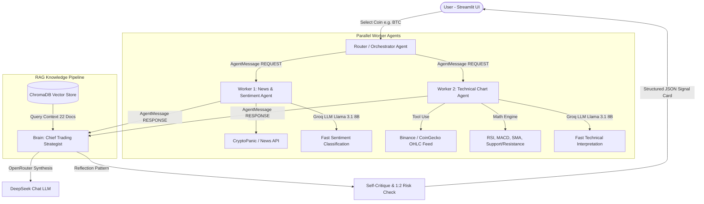
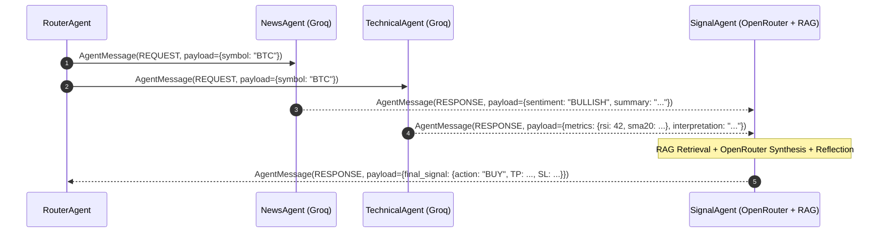

# 📈 Crypto SignalSense — Autonomous Multi-Agent Trading Signal System

[](https://www.python.org/downloads/)
[](https://streamlit.io/)
[]()

Crypto SignalSense is an intelligent, multi-agent AI system engineered to assist retail traders by conducting automated market sentiment analysis, technical chart pattern evaluation, and RAG-grounded trading strategy synthesis for top cryptocurrencies (**BTC, ETH, BNB, SOL, XRP**).

---

## 🏛️ System Architecture



---

## 🤖 Agentic Design Patterns Implemented

The system implements **4 distinct agentic design patterns** (surpassing the mandatory requirement of 3):

| Design Pattern | Location in Codebase | Functional Role |
| :--- | :--- | :--- |
| **1. Router Pattern** | [`agents/router.py`](agents/router.py) | Inspects target coin selection and dispatches structured request messages. |
| **2. Orchestrator-Worker Pattern** | [`agents/router.py`](agents/router.py) | Coordinates execution between specialized worker agents (`NewsAgent` & `TechnicalAgent`) and synthesizes outputs via `SignalAgent`. |
| **3. Tool-Use Pattern** | [`agents/news_agent.py`](agents/news_agent.py)<br>[`agents/technical_agent.py`](agents/technical_agent.py) | Agents invoke external APIs (`Binance`, `CryptoPanic`) and deterministic Python indicator math tools (`RSI`, `MACD`, `SMA`). |
| **4. Reflection / Self-Critique Pattern** | [`agents/signal_agent.py`](agents/signal_agent.py) | Pre-signal validation pass enforcing strict Risk-to-Reward ratio ($\ge 1:2$) and checking for sentiment/technical contradictions. |

---

## 💬 Agent-to-Agent Communication Protocol

Agents communicate strictly via structured, decoupled JSON-like message objects defined in [`agents/protocol.py`](agents/protocol.py).



---

## 🧠 Model Selection Strategy & Comparison Table

We deliberately employ a multi-model strategy pairing high-speed, low-cost models on **Groq** for narrow classification sub-tasks with high-reasoning models on **OpenRouter** for strategy synthesis and self-critique.

| Sub-task | Model & Provider | Cost / Latency | Context / Quality | Justification |
| :--- | :--- | :--- | :--- | :--- |
| **News Sentiment & Tech Summarization** | `llama-3.1-8b-instant` (**Groq**) | Ultra-low latency (~200ms)<br>Near-zero cost | 128k context<br>Sufficient for 3-class sentiment | Fast extraction of news sentiment without paying high reasoning overhead. |
| **Deep Reasoning Strategy Synthesis & Reflection** | `deepseek/deepseek-chat` (**OpenRouter**) | Medium latency (~1.5s)<br>Low cost ($0.14/M tokens) | 64k context<br>Exceptional reasoning | Deep reasoning required to integrate technical indicators, news, and RAG rules while calculating valid 1:2 risk setups. |

---

## 📚 RAG Pipeline & Retrieval Evaluation

The RAG Knowledge Base comprises **22 domain-specific PDF and Markdown documents** stored in [`rag/corpus/`](rag/corpus/), covering candlestick playbooks, indicator formulas, risk management rules, position sizing, and coin fundamentals.

### 5-Query Retrieval Evaluation Report
As required by Section 4 (d) of the assignment brief, 5 domain queries were evaluated against the vector store using [`rag/evaluator.py`](rag/evaluator.py):

| Query # | Test Query | Top Retrieved Corpus Doc | Relevance Result |
| :---: | :--- | :--- | :---: |
| 1 | *What is the overbought RSI threshold and signal rule?* | `01_rsi_indicator_strategy.pdf` | **RELEVANT** (Score: 23.0) |
| 2 | *How do I set Stop Loss and Take Profit with 1:2 risk ratio?* | `08_risk_management_1to2_rule.pdf` | **RELEVANT** (Score: 23.0) |
| 3 | *What does a Bullish Engulfing pattern indicate at support?* | `05_candlestick_bullish_patterns.pdf` | **RELEVANT** (Score: 27.0) |
| 4 | *What are fundamental drivers for Solana SOL DEX volume?* | `16_sol_solana_fundamental_profile.pdf` | **RELEVANT** (Score: 25.0) |
| 5 | *What is the reflection checklist for validating trade setups?* | `22_reflection_and_self_critique_rules.pdf` | **RELEVANT** (Score: 19.0) |

---

## 💻 Local Setup & Run Guide

### 1. Clone & Install Dependencies
```bash
git clone https://github.com/your-username/Crypto_SignalSense.git
cd Crypto_SignalSense
python -m venv venv
# Activate environment:
# Windows: venv\Scripts\activate
# Mac/Linux: source venv/bin/activate
pip install -r requirements.txt
```

### 2. Configure Environment Variables
Copy `.env` 
```env
GROQ_API_KEY=your_groq_api_key
OPENROUTER_API_KEY=your_openrouter_api_key
OPENROUTER_MODEL=deepseek/deepseek-chat
```

### 3. Run Streamlit Application
```bash
streamlit run app.py
```

---

## 🌐 Live Streamlit Deployment
- **Live Streamlit Cloud URL:** `https://crypto-signalsense.streamlit.app/` 

---

## ⚠️ Academic & Financial Disclaimer
> [!IMPORTANT]
> **Educational & Research Disclaimer:** Signals, Entry prices, Take Profit, and Stop Loss estimates generated by this AI system are educational technical estimates calculated from Support/Resistance levels and ATR volatility bands for IT41043 coursework evaluation. They do not constitute financial advice, backtested execution guarantees, or commercial trading signals.
